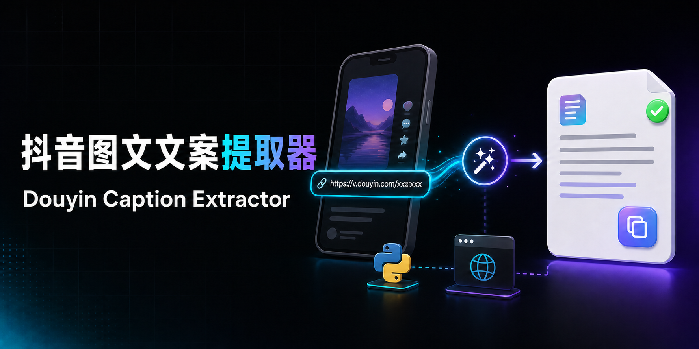
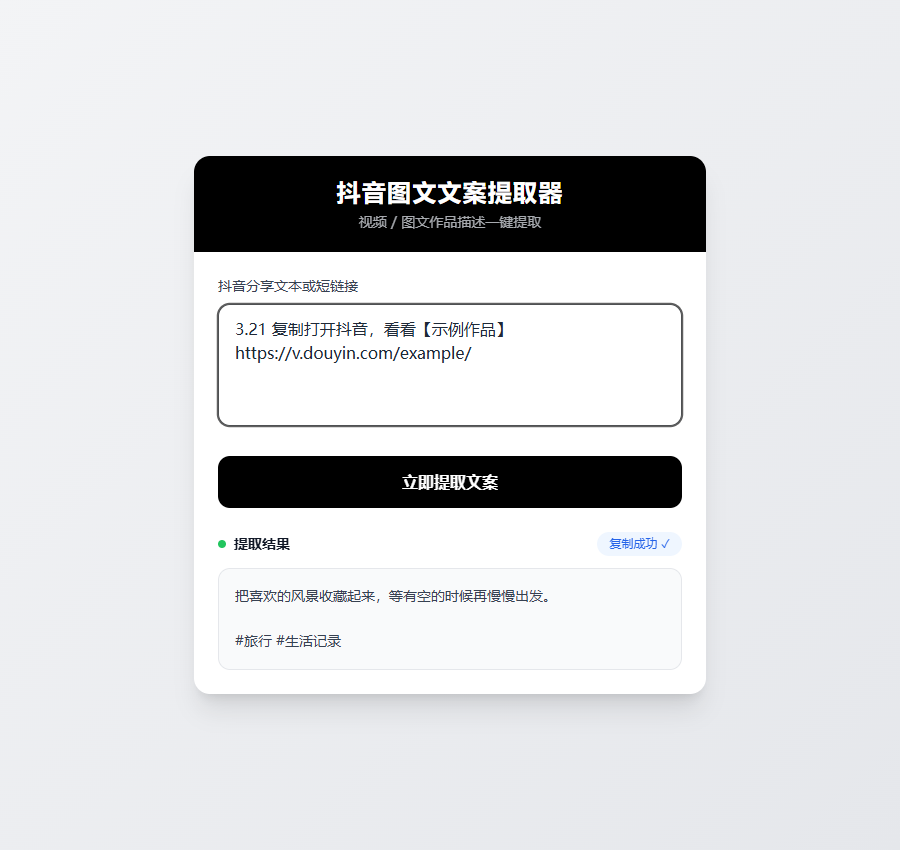
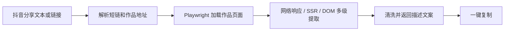

<p align="center">
  
</p>

<h1 align="center">抖音图文文案提取器</h1>

<p align="center">
  简体中文 · <a href="README_EN.md">English</a>
</p>

<p align="center">
  粘贴抖音视频或图文分享链接，一键提取并复制作品描述文案。<br>
  Paste a Douyin share link, extract the post description, and copy it instantly.
</p>

> [!TIP]
> **无需安装：** [打开 HTTPS 在线体验](https://change333.dpdns.org/)。在线演示面向个人和低并发试用。

<p align="center">
  <a href="https://github.com/Change3333/douyin-caption-extractor/actions/workflows/ci.yml"></a>
  <a href="https://www.python.org/"></a>
  <a href="https://flask.palletsprojects.com/"></a>
  <a href="https://playwright.dev/python/"></a>
  <a href="LICENSE"></a>
  <a href="https://github.com/Change3333/douyin-caption-extractor/stargazers"></a>
</p>

> [!NOTE]
> 本项目提取的是作品发布者填写的描述文案，不包含视频语音转文字或画面 OCR。

如果这个项目帮你节省了时间，欢迎点亮右上角的 **Star**。你的支持会让更多人发现它。

## 为什么使用它

- **复制即用**：支持从完整分享文本中自动识别链接
- **短链支持**：兼容常见的 `v.douyin.com` 分享短链接
- **多级提取**：依次尝试网络响应、SSR 数据、页面元素和标题
- **覆盖多类型**：兼容视频及图文作品页面
- **移动端友好**：自适应手机浏览器
- **可靠复制**：兼容 HTTPS、localhost 和局域网 HTTP
- **单文件部署**：核心应用集中在 `douyin_desc.py`

## 界面预览

<p align="center">
  
</p>

输入完整分享文本或链接后，提取结果会保留换行，并可通过右上角按钮一键复制。

## 工作流程



## 快速开始

### 环境要求

- Python 3.10+
- Chromium
- Linux 服务器使用可见浏览器模式时需要 Xvfb

### Windows

```powershell
python -m venv .venv
.\.venv\Scripts\Activate.ps1
pip install -r requirements.txt
playwright install chromium
python douyin_desc.py
```

### Linux

```bash
python3 -m venv .venv
source .venv/bin/activate
pip install -r requirements.txt
playwright install chromium
xvfb-run -a python douyin_desc.py
```

启动后访问 `http://127.0.0.1:5000`。局域网中的手机可通过 `http://电脑局域网IP:5000` 访问。

## Linux 服务器部署

安装系统依赖：

```bash
sudo apt update
sudo apt install -y python3-venv xvfb
python -m playwright install --with-deps chromium
```

生产环境建议使用 Gunicorn，并通过 Nginx 提供 HTTPS：

```bash
pip install -r requirements-server.txt
xvfb-run -a gunicorn \
  --workers 1 \
  --threads 1 \
  --bind 127.0.0.1:5000 \
  douyin_desc:app
```

Playwright 同步 API 不应在多个线程之间共享。高并发场景建议使用任务队列，并限制同时运行的浏览器数量。

## 常见问题

<details>
<summary><strong>一键复制没有反应</strong></summary>

`navigator.clipboard` 通常只允许在 HTTPS 或 localhost 中使用。本项目会在局域网 HTTP 环境下自动使用兼容复制方案；生产网站仍建议配置 HTTPS。

</details>

<details>
<summary><strong>偶尔提取失败</strong></summary>

抖音页面结构、风控策略和登录状态可能发生变化。遇到失败时可以：

1. 稍后重试；
2. 在浏览器中打开短链接，再复制跳转后的完整链接；
3. 检查服务器是否能够正常启动 Chromium；
4. 查看服务端日志中是否存在超时或验证页面。

</details>

<details>
<summary><strong>服务器重启后网站没有恢复</strong></summary>

建议使用 systemd、Supervisor 或容器管理服务，不要只依赖 SSH 会话中的后台进程。

</details>

## 路线图

- [ ] 增强短链重试和错误诊断
- [ ] 按作品 ID 精确匹配网络数据
- [ ] 提供 Docker 部署方式
- [ ] 增加可选的语音转文字和画面 OCR
- [ ] 完善自动化测试

欢迎通过 [Issues](https://github.com/Change3333/douyin-caption-extractor/issues) 提交问题或建议，也可以阅读 [贡献指南](CONTRIBUTING.md) 参与改进。

## 使用说明

本项目仅供学习、研究及处理你有权访问的内容。使用时请遵守适用法律、网站服务条款、版权规则和访问频率限制。请勿用于批量采集、绕过访问控制或侵犯他人权益。

## License

[MIT](LICENSE) © Contributors
